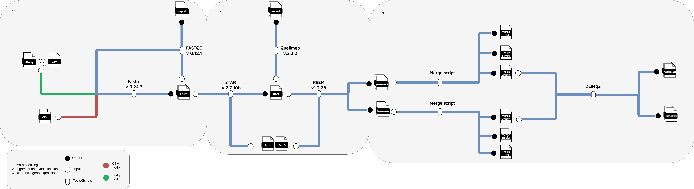
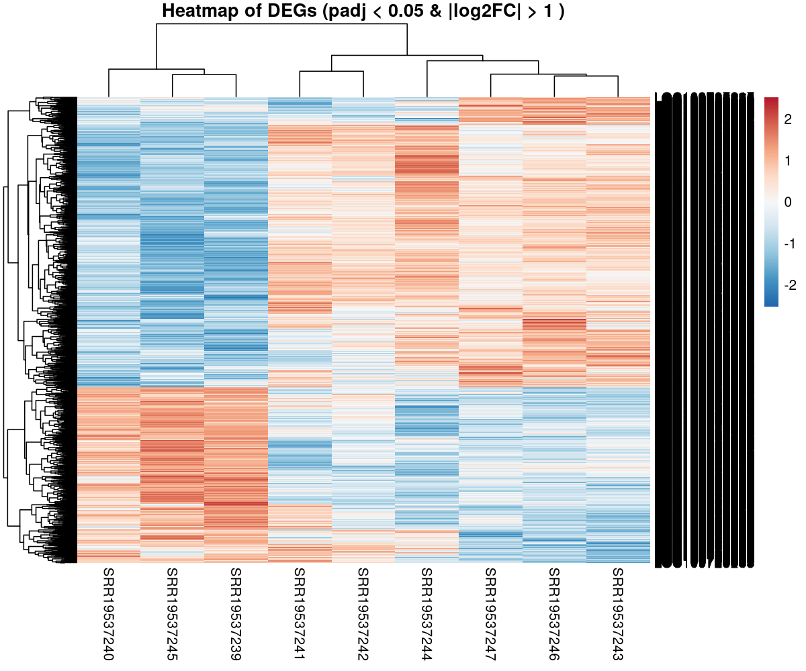
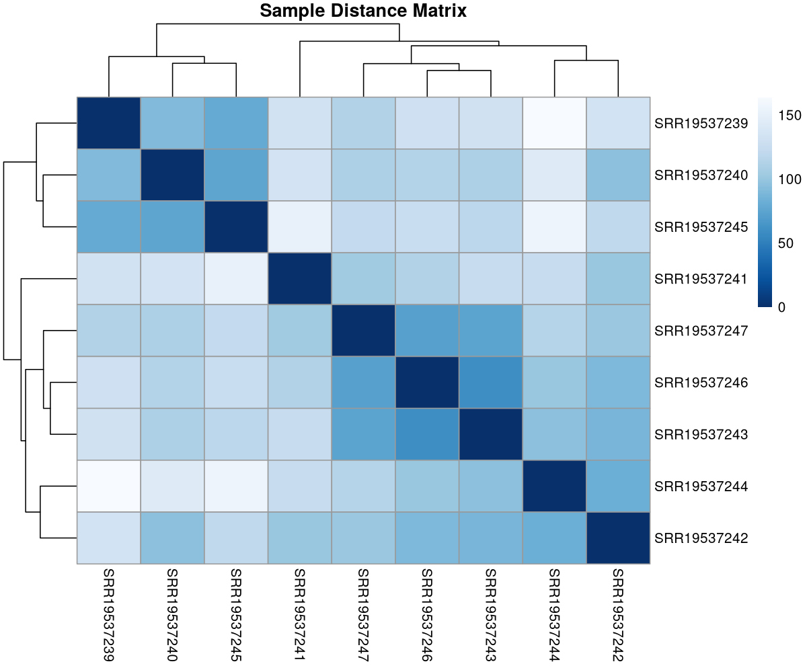
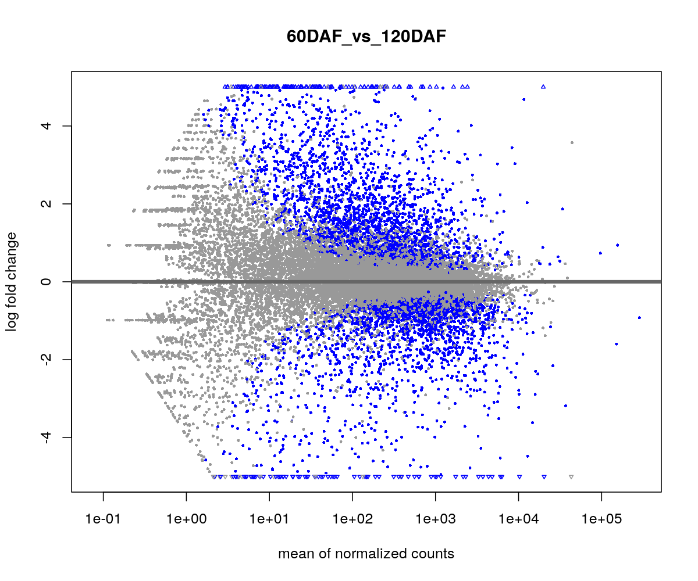
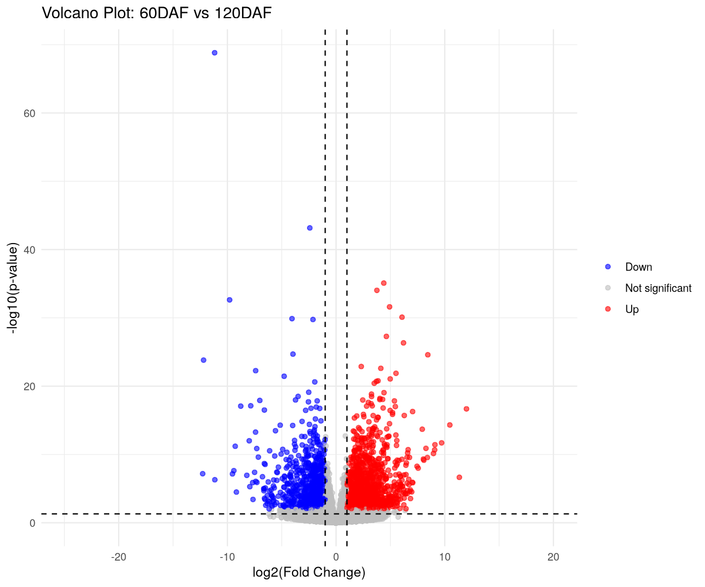

# Nextflow-RNASeq
## หัวข้อ
1. [บทนำ](#1-บทนำ)
2. [การใช้งาน Nextflow-RNASeq](#2-การใช้งาน-Nextflow-RNASeq)
3. [การเตรียมเครื่องมือและข้อมูลสำหรับ Nextflow-RNASeq](#3-การเตรียมเครื่องมือและข้อมูลสำหรับ-Nextflow-RNASeq)
4. [รายละเอียดขั้นตอนใน Nextflow-RNASeq](#4-รายละเอียดขั้นตอนใน-Nextflow-RNASeq)
5. [Output](#5-Output)
   
---
## 1. บทนำ
Nextflow-RNASeq เป็น bioinformatics pipline ที่พัฒนาขึ้นสำหรับการทำ RNASeq โดยจะมีขั้นตอนดังต่อไปนี้ 
1. Pre-processing
2. Sequence Alignment and Quantification
3. Differential gene expression

## 2. การใช้งาน Nextflow-RNASeq
### การใช้งานแบบ single-end
```bash
nextflow run -profile gb main.nf \
    --fastq data-single \
    --fasta /nbt_main/home/lattapol/mycassava/reference/Mesculenta_305_v6.fa  \
    --gtf /nbt_main/home/lattapol/mycassava/reference/Mesculenta_305_v6.1.gene.gtf \
    --conditions_file /nbt_main/home/lattapol/nextflow-RNAseq/data/conditions_test2.csv \
    --mode fastq \
    --reads_type single-end \
    --multimap 1 \
    --unmaped Within \
    --overhang 100 \
    --conditions Condition \
    --contrast ESR_vs_Fi \
    --padj 0.05 \
    --lfc 1.0 \
    --output output \
```
```bash
nextflow run -profile gb main.nf \
    --fastq <path>/input \
    --fasta <path>/reference.fa \
    --gtf <path>/reference.gtf \
    --meta <path>/conditions.csv \
    --mode fastq \
    --reads_type single-end \
    --multimap 1 \
    --unmaped Within \
    --overhang 100 \
    --conditions Condition \
    --contrast A_vs_B \
    --padj 0.05 \
    --lfc 1.0 \
    --output output \
```
```bash
nextflow run -profile gb main.nf --fastq fastq --fasta reference/reference.fa \
    --gtf reference/reference.gtf \
    --meta metadata.csv \
    --mode csv \
    --reads_type <single-end> or <paired-end>  \
    --conditions Condition1 \
    --contrast A_vs_B \
    --output output \
```

### การใช้งานแบบ paired-end  
```bash
nextflow run -profile gb main.nf \
    --fastq data-paired \
    --fasta /nbt_main/home/lattapol/mycassava/reference/Mesculenta_305_v6.fa  \
    --gtf /nbt_main/home/lattapol/mycassava/reference/Mesculenta_305_v6.1.gene.gtf \
    --meta /nbt_main/home/lattapol/nextflow-RNAseq/data/conditions_test2.csv \
    --mode fastq \
    --reads_type paired-end \
    --multimap 1 \
    --unmaped Within \
    --overhang 100 \
    --conditions Condition \
    --contrast ESR_vs_Fi \
    --padj 0.05 \
    --lfc 1.0 \
    --output output \
```

### การใช้งานแบบ meta Data
```bash
nextflow run -profile gb main.nf \
    --fastq data \
    --meta /nbt_main/home/lattapol/nextflow-RNAseq/data/aha2.csv \
    --fasta /nbt_main/home/lattapol/mycassava/reference/Mesculenta_305_v6.fa  \
    --gtf /nbt_main/home/lattapol/mycassava/reference/Mesculenta_305_v6.1.gene.gtf \
    --mode csv \
    --reads_type paired-end \
    --multimap 1 \
    --unmaped Within \
    --overhang 100 \
    --conditions con3 \
    --contrast ESR_vs_Fi \
    --padj 0.05 \
    --lfc 1.0 \
    --output results \
```
```bash
nextflow run -profile gb main.nf \
    --fastq <path>/input \
    --input <path>/input.csv \
    --fasta <path>/reference.fa  \
    --gtf <path>/reference.gtf \
    --mode csv \
    --reads_type paired-end \
    --multimap 1 \
    --unmaped Within \
    --overhang 100 \
    --conditions Condition \
    --contrast A_vs_B \
    --padj 0.05 \
    --lfc 1.0 \
    --output results \
```
### Options
- `--fastq` = โฟลเดอร์ไฟล์ fastq 
- `--fasta` = ไฟล์ fasta (จำเป็น)
- `--gtf` = ไฟล์ gtf (จำเป็น)
- `--meta` = ไฟล์ csv ที่มี conditions ของตัวอย่าง สำหรับทำ Differential gene expression (สำหรับ --mode csv จะมีข้อมูล reads อยู่ด้วย)
- `--reads_type`  = ชนิดของ reads (จำเป็น:single-end, paired-end|ค่าเริ่มต้น:paired-end)
- `--mode` = mode ไฟล์ input (จำเป็น:fastq, csv|ค่าเริ่มต้น:csv)
- `--adapter` = adapter ที่ต้องการตัด (ค่าเริ่มต้น:AGATCGGAAGAG)
- `--minlen` = จำนวน reads ที่สั้นที่สุดที่ยอมรับได้สำหรับขั้นตอน Pre-processing (ค่าเริ่มต้น:50)
- `--phred` = ค่า phred score สำหรับขั้นตอน Pre-processing (ค่าเริ่มต้น:20)
- `--conditions` = conditions สำหรับทำ Differential gene expression (จำเป็น)
- `--contrast`  = conditions ที่จะเปลี่ยบเทียบ (จำเป็น:A_vs_B)
- `--multimap` = จำนวนสูงสุดที่ reads จะ mapped กับตำแน่งใน Reference ในขั้นตอน Alingment (ค่าเริ่มต้น:10)
- `--unmaped` = ไฟล์ unmapped จาก ขั้นตอน Alignment (Within หรือ null|ค่าเริ่มต้น:null)
- `--overhang` = จำนวน reads ที่ยาวที่สุด -1 (ค่าเริ่มต้น:100)
- `--padj` =  ค่า padj ในขั้นตอน Differential gene expression
- `--lfc` =  ค่า log2 fold change ในขั้นตอน Differential gene expression
- `--output` = โฟลเดอร์หรือไฟล์ output (จำเป็น)
## 3. การเตรียมเครื่องมือและข้อมูลสำหรับ Nextflow-RNASeq
## เครืองมือ 
Nextflow: version 19
1. Pre-processing
   - Fastp version 0.24.3
   - FastQC version 0.11.9
2. Sequence Alignment and Quantification
   - STAR version 2.7.11b
   - Qualimap versions 2.3
   - RSEM version 1.3.3
4. Differential gene expression:
   - R version 4.5.1
### การเตรียม Config
ผู้ใช้งานสามารปรับแต่งเครื่องมือที่ใช้งานในไฟล์ gb.config ให้เหมาะสมกับทรัพยากรในเครื่อง โดย gb.config จะทำงานรวมกับ nextflow.config โดยจะใช้ตัวเลือก `-profile` เพื่อเลือก config ที่จะใช้งาน
```bash
Project
├── configs
│    └── gb.config
├── modules
│    ├── nbt
│    │    ├── help.nf
│    │    ├── log.nf
│    │    └── utils.nf
│    ├── DESeq2.nf
│    ├── alignment.nf
│    ├── count.nf
│    ├── preprocess.nf
│    ├── rsem.nf
│    └── visualize.nf
├── schemas
│    ├── key.avsc
│    ├── register.sh
│    └── value.avsc
├── main.nf
└── nextflow.config

```
```bash
process {
  executor = 'slurm'
  queue = 'memory'
  cache = 'lenient'

  withName: TrimmmomaticParied {
    module = 'Trimmomatic/0.38-Java-1.8'
    cpus = 4
    memory = '8 GB'
  }

  withName: TrimmmomaticSingle {
    module = 'Trimmomatic/0.38-Java-1.8'
    cpus = 4
    memory = '8 GB'
  }

  withName: FastpForParied {
    beforeScript = 'export PATH=$HOME/tools:$PATH'
    cpus = 4
    memory = '8 GB'
  }

  withName: FastpForSingle {
    beforeScript = 'export PATH=$HOME/tools:$PATH'
    cpus = 4
    memory = '8 GB'
  }

  withName: FastqcForPairedAfter {
    module = 'FastQC/0.11.9-Java-11'
    cpus = 4
    memory = '8 GB'
  }

  withName: FastqcForPairedBefore {
    module = 'FastQC/0.11.9-Java-11'
    cpus = 4
    memory = '8 GB'
  }

  withName: FastqcForSingleAfter {
    module = 'FastQC/0.11.9-Java-11'
    cpus = 4
    memory = '8 GB'
  }

  withName: FastqcForSingleBefore {
    module = 'FastQC/0.11.9-Java-11'
    cpus = 4
    memory = '8 GB'
  }

  withName: FastqcForSingleBefore {
    module = 'FastQC/0.11.9-Java-11'
    cpus = 4
    memory = '8 GB'
  }

  withName: STAR_INDEX {
    //module = '/nbt_main/home/lattapol/tools/STAR-2.7.11b/STAR/source'
    beforeScript = 'export PATH=$HOME/tools/STAR-2.7.11b/STAR/source:$PATH'
    cpus = 8
    memory = '64 GB'
  }

  withName: STARForPaired {
    //module = '/nbt_main/home/lattapol/tools/STAR-2.7.11b/STAR/source'
    beforeScript = 'export PATH=$HOME/tools/STAR-2.7.11b/STAR/source:$PATH'
    cpus = 8
    memory = '64 GB'
  }

  withName: STARForSingle {
    //module = '/nbt_main/home/lattapol/tools/STAR-2.7.11b/STAR/source'
    beforeScript = 'export PATH=$HOME/tools/STAR-2.7.11b/STAR/source:$PATH'
    cpus = 8
    memory = '64 GB'
  }

  withName: RSEM_INDEX {
    //module = '/nbt_main/home/lattapol/tools/RSEM-1.3.3'
    beforeScript = 'export PATH=$HOME/tools/RSEM-1.3.3:$PATH'
    cpus = 8
    memory = '64 GB'
  }

  withName: RSEMForPaired {
    //module = '/nbt_main/home/lattapol/tools/RSEM-1.3.3'
    beforeScript = 'export PATH=$HOME/tools/RSEM-1.3.3:$PATH'
    cpus = 8
    memory = '64 GB'
  }

  withName: RSEMForSingle {
    beforeScript = 'export PATH=$HOME/tools/RSEM-1.3.3:$PATH'
    cpus = 8
    memory = '64 GB'
  }

  withName: Qualimap {
  container = '/nbt_main/share/singularity/qualimap:2.3--hdfd78af_0'
  cpus = 4
  memory = '8 GB'
  }

  withName: MergeRSEMResultsIso {
    module = 'Python/3.10.4-GCCcore-11.3.0'
    cpus = 4
    memory = '8 GB'
  }

  withName: MergeRSEMResultsGenes {
    module = 'Python/3.10.4-GCCcore-11.3.0'
    cpus = 4
    memory = '8 GB'
  }

  withName: DESeq2ForIso {
    container = '/nbt_main/share/singularity/r_popgen_animal.sif'
    cpus = 4
    memory = '8 GB'
  }

  withName: DESeq2ForGene {
    container = '/nbt_main/share/singularity/r_popgen_animal.sif'
    cpus = 4
    memory = '8 GB'
  }

}

singularity {
    enabled = true
    autoMounts = true
}
```
## 4. รายละเอียดขั้นตอนใน Nextflow-RNASeq
### การทำ Pre-processing
เครื่องมือชีวสารสนเทศในการทำ Pre-processing ได้แก่ Fastp (version 0.24.3) สำหรับการปรับแต่งคุณภาพข้อมูล และใช้ FastQC (version 0.11.9) ในการแสดงผลข้อมูลก่อนและหลังปรับแต่งคุณภาพของข้อมูล 
```bash
process FastqcForPaired {

  tag { key }
  publishDir "${outputPrefixPath(params, task)}"
  publishDir "${s3OutputPrefixPath(params, task)}"

  input:
  tuple key, file(reads1), file(reads2)

  output:
  tuple key, file("*.zip"), file("*.html")

  script:
  """
  fastqc ${reads1} ${reads2} --threads 8
  """
}
```
```bash
process FastqcForSingle {

  tag { key }
  publishDir "${outputPrefixPath(params, task)}"
  publishDir "${s3OutputPrefixPath(params, task)}"

  input:
  tuple key, file(reads)

  output:
  tuple key, file("*.zip"), file("*.html")

  script:
  """
  fastqc --threads 8 ${reads}
  """
}
```
```bash
process FastQC_visualize {


  publishDir "${outputPrefixPath(params, task)}"
  publishDir "${s3OutputPrefixPath(params, task)}"

  input:
  path zip

  output:
  path "summary.csv"

  script:

  """
  mkdir -p extracted
  for file in *.zip; do
      unzip -o "\$file" -d extracted/ > /dev/null
  done

  echo "file_name,Total_Sequences_BeforeQC,Total_Sequences_AfterQC,Sequence_length_BeforeQC,Sequence_length_AfterQC,%GC_BeforeQC,%GC_AfterQC" > summary.csv
  declare -A before_qc after_qc

  for file in extracted/*/fastqc_data.txt; do
      filename=\$(grep "Filename" "\$file" | cut -f2)
      total_sequences=\$(grep "Total Sequences" "\$file" | cut -f2)
      seq_length=\$(grep "Sequence length" "\$file" | cut -f2)
      gc_content=\$(grep "%GC" "\$file" | cut -f2)

      base_name=\$(echo "\$filename" | sed -E 's/_R[12].+//')

      if [[ "\$filename" == *filtered.fastq.gz ]]; then
          after_qc["\$base_name"]="\$total_sequences,\$seq_length,\$gc_content"
      else
          before_qc["\$base_name"]="\$total_sequences,\$seq_length,\$gc_content"
      fi
  done

  for key in "\${!before_qc[@]}"; do
      before="\${before_qc[\$key]:-,,}"
      after="\${after_qc[\$key]:-,,}"

      before_total_sequences=\$(echo \$before | cut -d',' -f1)
      before_seq_length=\$(echo \$before | cut -d',' -f2)
      before_gc_content=\$(echo \$before | cut -d',' -f3)

      after_total_sequences=\$(echo \$after | cut -d',' -f1)
      after_seq_length=\$(echo \$after | cut -d',' -f2)
      after_gc_content=\$(echo \$after | cut -d',' -f3)

      echo "\$key,\$before_total_sequences,\$after_total_sequences,\$before_seq_length,\$after_seq_length,\$before_gc_content,\$after_gc_content" >> summary.csv
  done

  """
}
```
```bash
process FastpForParied {

  tag { "${fileId}" }

  publishDir "${outputPrefixPath(params, task)}"
  publishDir "${s3OutputPrefixPath(params, task)}"

  input:
  tuple val(fileId), file(read1), file(read2)

  output:
  tuple val(fileId), file("${prefix}_R1_q${params.phred}.cutadap.gz"), file("${prefix}_R2_q${params.phred}.cutadap.gz")
  tuple val(fileId), file("${prefix}_q${params.phred}.cutadap.html"), file("${prefix}_q${params.phred}.cutadap.json")

  script:
  prefix=fileId

  """
  fastp --in1 ${read1} --out1 ${prefix}_R1_q${params.phred}.cutadap.gz \
        --in2 ${read2} --out2 ${prefix}_R2_q${params.phred}.cutadap.gz \
        --qualified_quality_phred ${params.phred} \
        --detect_adapter_for_pe \
        --trim_poly_g --trim_poly_x \
        --length_required ${params.minlen} \
        --adapter_sequence ${params.adapter} \
        --html ${prefix}_q${params.phred}.cutadap.html \
        --json ${prefix}_q${params.phred}.cutadap.json \
        --thread 8
  """
}
```
```bash
process FastpForSingle {

  tag { "${fileId}" }

  publishDir "${outputPrefixPath(params, task)}"
  publishDir "${s3OutputPrefixPath(params, task)}"

  input:
  tuple val(fileId), file(read1)

  output:
  tuple val(fileId), file("${prefix}_q${params.phred}.cutadap.gz")
  tuple val(fileId), file("${prefix}_q${params.phred}.cutadap.html"), file("${prefix}_q${params.phred}.cutadap.json")

  script:
  prefix=fileId

  """
  fastp -i ${read1} -o ${prefix}_q${params.phred}.cutadap.gz \
        --qualified_quality_phred ${params.phred} \
        --trim_poly_g --trim_poly_x \
        --adapter_sequence ${params.adapter} \
        --length_required ${params.minlen} \
        --html ${prefix}_q${params.phred}.cutadap.html \
        --json ${prefix}_q${params.phred}.cutadap.json \
        --thread 8
  """
}
```
### การทำ Sequenece Alingment และ Quantification
เครื่องมือชีวสารสนเทศในการทำ Sequenece Alingment ได้แก่ STAR (version 2.7.11b) และใช้ Qualimap (versions 2.3) ในการแสดงผลการ mapped ของข้อมูล reads ตัวอย่างกับ Reference ส่วนการทำ Quantification ได้ใช้เครื่องมือ RSEM (version 1.3.3) ในการนับ 
```bash
process STAR_INDEX {

  input:
  file(fasta)
  file(gtf)

  output:
  path "STAR_index"

  script:
  """
  STAR --runThreadN 12 --runMode genomeGenerate --genomeDir STAR_index --genomeFastaFiles ${fasta} --sjdbGTFfile ${gtf} --sjdbOverhang ${params.overhang}
  """
}
```
```bash
process STARForPaired {

  tag { key }
  publishDir "${outputPrefixPath(params, task)}"
  publishDir "${s3OutputPrefixPath(params, task)}"

  input:
  tuple val(key), file(reads1), file(reads2),path(STAR_index)

  output:
  file("*.sortedByCoord.out.bam")
  file("*.toTranscriptome.out.bam")

  script:
  """
  STAR --genomeDir ${STAR_index} --runThreadN 12 --readFilesIn ${reads1} ${reads2} --readFilesCommand zcat \
       --outFileNamePrefix ${key}. --outFilterMultimapNmax ${params.multimap} --outSAMunmapped ${params.unmaped} --outSAMtype BAM SortedByCoordinate \
       --quantMode TranscriptomeSAM
  """
}
```
```bash
process STARForSingle {

  tag { key }
  publishDir "${outputPrefixPath(params, task)}"
  publishDir "${s3OutputPrefixPath(params, task)}"

  input:
  tuple val(key), file(reads), path(STAR_index)

  output:
  file("*.sortedByCoord.out.bam")
  file("*.toTranscriptome.out.bam")

  script:
  """
  STAR --genomeDir ${STAR_index} --runThreadN 12 --readFilesIn ${reads} --readFilesCommand zcat \
       --outFileNamePrefix ${key}. --outFilterMultimapNmax ${params.multimap} --outSAMunmapped ${params.unmaped} --outSAMtype BAM SortedByCoordinate \
       --quantMode TranscriptomeSAM
  """
}
```
```bash
process Qualimap {

  tag { prefix }
  publishDir "${outputPrefixPath(params, task)}"
  publishDir "${s3OutputPrefixPath(params, task)}"

  input:
  file(bam)

  output:
  file "*"

  script:
  prefix=bam.baseName

  """
  qualimap bamqc -bam ${bam}
  """
```
```bash
process Qualimap_visualize {

  publishDir "${outputPrefixPath(params, task)}"
  publishDir "${s3OutputPrefixPath(params, task)}"

  input:
  path qmap

  output:
  path "*"

  script:

  """
  echo "filename,number_of_reads,number_of_mapped_reads(%),number_of_unmapped_reads(%)" > qualimap_summary.csv

  for dir in *_stats; do
      file="\$dir/genome_results.txt"
      if [[ -f "\$file" ]]; then
         name=\$(echo "\$dir" | sed 's/_stats//')
         total_reads=\$(grep "number of reads =" "\$file" | awk '{print \$NF}' | tr -d ',')
         mapped_percent=\$(grep "number of mapped reads =" "\$file" | awk -F '[()]' '{print \$2}' | tr -d '%')

         unmapped_percent=\$(awk -v mp="\$mapped_percent" 'BEGIN {printf "%.2f", 100 - mp}')

         echo "\$name,\$total_reads,\$mapped_percent,\$unmapped_percent" >> qualimap_summary.csv
      fi
  done
  """
}
```
```bash
process RSEM_INDEX {

    input:
    file(fasta)
    file(gtf)

    output:
    path "*"

    script:
    """
    rsem-prepare-reference --gtf ${gtf} ${fasta} --num-threads 12 ref_data
    """
}
```
```bash
process RSEMForPaired {

  tag { prefix }
  publishDir "${outputPrefixPath(params, task)}"
  publishDir "${s3OutputPrefixPath(params, task)}"

  input:
  tuple file(bam), path(index_ch1), path(index_ch2), path(index_ch3), path(index_ch4), path(index_ch5), path(index_ch6), path(index_ch7)

  output:
  file("${prefix}.genes.results")
  file("${prefix}.isoforms.results")
  file("${prefix}.stat")


  script:

  prefix=bam.baseName
  """
  rsem-calculate-expression --bam --no-bam-output --paired-end --num-threads 12 ${bam} ref_data ${prefix}
  """
}
```
```bash
process RSEMForSingle {

  tag { prefix }
  publishDir "${outputPrefixPath(params, task)}"
  publishDir "${s3OutputPrefixPath(params, task)}"

  input:
  tuple file(bam), path(index_ch1), path(index_ch2), path(index_ch3), path(index_ch4), path(index_ch5), path(index_ch6), path(index_ch7)

  output:
  file("${prefix}.genes.results")
  file("${prefix}.isoforms.results")
  file("${prefix}.stat")


  script:

  prefix=bam.baseName
  """
  rsem-calculate-expression --bam --no-bam-output --num-threads 12 ${bam} ref_data ${prefix}
  """
}
```
```bash
process MergeRSEMResultsGenes {

  tag "merge RSEM results"
  publishDir "${outputPrefixPath(params, task)}"
  publishDir "${s3OutputPrefixPath(params, task)}"

  input:
  path rsem_results

  output:
  path "merged_expected_count.csv"
  path "merged_TPM.csv"
  path "merged_FPKM.csv"

  script:
  """
python3 - <<'EOF'
import pandas as pd
import os

files = [${rsem_results.collect { "\"${it.getName()}\"" }.join(',\n')}]
dfs = {}
for filepath in files:
    sample_name = os.path.basename(filepath).split(".")[0]
    df = pd.read_csv(filepath, sep='\\t')
    df = df[['gene_id', 'expected_count', 'TPM', 'FPKM']]
    df.rename(columns={
        'expected_count': f'{sample_name}_expected_count',
        'TPM': f'{sample_name}_TPM',
        'FPKM': f'{sample_name}_FPKM'
    }, inplace=True)
    dfs[sample_name] = df

merged_df = list(dfs.values())[0]
for df in list(dfs.values())[1:]:
    merged_df = merged_df.merge(df, on='gene_id')

count_df = merged_df[['gene_id'] + [col for col in merged_df.columns if col.endswith('_expected_count')]]
count_df = count_df.rename(columns=lambda x: x.replace('_expected_count', '') if x != 'transcript_id' else x)

tpm_df = merged_df[['gene_id'] + [col for col in merged_df.columns if col.endswith('_TPM')]]
tpm_df = tpm_df.rename(columns=lambda x: x.replace('_TPM', '') if x != 'transcript_id' else x)

fpkm_df = merged_df[['gene_id'] + [col for col in merged_df.columns if col.endswith('_FPKM')]]
fpkm_df = fpkm_df.rename(columns=lambda x: x.replace('_FPKM', '') if x != 'transcript_id' else x)

count_df.to_csv('merged_expected_count.csv', sep=',', index=False)
tpm_df.to_csv('merged_TPM.csv', sep=',', index=False)
fpkm_df.to_csv('merged_FPKM.csv', sep=',', index=False)
EOF
  """
```
```bash
process MergeRSEMResultsIso {

  tag "merge RSEM results"
  publishDir "${outputPrefixPath(params, task)}"
  publishDir "${s3OutputPrefixPath(params, task)}"

  input:
  path rsem_results

  output:
  path "merged_expected_count.csv"
  path "merged_TPM.csv"
  path "merged_FPKM.csv"

  script:
  """
python3 - <<'EOF'
import pandas as pd
import os

files = [${rsem_results.collect { "\"${it.getName()}\"" }.join(',\n')}]
dfs = {}
for filepath in files:
    sample_name = os.path.basename(filepath).split(".")[0]
    df = pd.read_csv(filepath, sep='\\t')
    df = df[['transcript_id', 'expected_count', 'TPM', 'FPKM']]
    df.rename(columns={
        'expected_count': f'{sample_name}_expected_count',
        'TPM': f'{sample_name}_TPM',
        'FPKM': f'{sample_name}_FPKM'
    }, inplace=True)
    dfs[sample_name] = df

merged_df = list(dfs.values())[0]
for df in list(dfs.values())[1:]:
    merged_df = merged_df.merge(df, on='transcript_id')

count_df = merged_df[['transcript_id'] + [col for col in merged_df.columns if col.endswith('_expected_count')]]
count_df = count_df.rename(columns=lambda x: x.replace('_expected_count', '') if x != 'transcript_id' else x)

tpm_df = merged_df[['transcript_id'] + [col for col in merged_df.columns if col.endswith('_TPM')]]
tpm_df = tpm_df.rename(columns=lambda x: x.replace('_TPM', '') if x != 'transcript_id' else x)

fpkm_df = merged_df[['transcript_id'] + [col for col in merged_df.columns if col.endswith('_FPKM')]]
fpkm_df = fpkm_df.rename(columns=lambda x: x.replace('_FPKM', '') if x != 'transcript_id' else x)

count_df.to_csv('merged_expected_count.csv', sep=',', index=False)
tpm_df.to_csv('merged_TPM.csv', sep=',', index=False)
fpkm_df.to_csv('merged_FPKM.csv', sep=',', index=False)
EOF
  """
}
```
### การทำ Differential gene expression
เครื่องมือชีวสารสนเทศที่ใช้ในการทำ Differential gene expression ได้แก่ DESeq2 ซึ่งเป็น package ของ R (version 4.5.1)
```bash
process DESeq2 {

    tag "${contrast}"
    publishDir "${outputPrefixPath(params, task)}"
    publishDir "${s3OutputPrefixPath(params, task)}"


    input:
    file(counts_file)

    output:
    path "*"

    script:
    """
    Rscript /nbt_main/home/lattapol/nextflow-RNAseq/bin/DESeq3.R --counts ${counts_file} --conditions_file ${params.input} \
      --conditions ${params.conditions} --contrast ${params.contrast} \
      --padj ${params.padj} \
      --lfc ${params.lfc} \
      --output . \
      > DESeq2.log 2>&1
    """
```
## 5. Output
### ภาพรวม Output
```bash
Project
├── fastq
│    ├── XXX01_R1.fastq.gz
│    ├── XXX01_R2.fastq.gz
│    ├── XXX02_R1.fastq.gz
│    ├── XXX02_R2.fastq.gz
│    ├── XXX03_R1.fastq.gz
│    └── XXX03_R2.fastq.gz
├── reference
│    ├── reference.fasta
│    └── reference.gtf
└── genotype
     └── genotype.csv

```
```bash
Project
├── fastq
│    ├── XXX01_R1.fastq.gz
│    ├── XXX01_R2.fastq.gz
│    ├── XXX02_R1.fastq.gz
│    ├── XXX02_R2.fastq.gz
│    ├── XXX03_R1.fastq.gz
│    └── XXX03_R2.fastq.gz
├── reference
│    ├── reference.fasta
│    └── reference.gtf
└── metadata
     └── metadata.csv
```

```bash
RNAseq_paired
├── DESeq2ForGene
│    ├── DEG_list.csv
│    ├── DEG_report.pdf
│    ├── DESeq2.log
│    ├── Heatmap_DEG.png
│    ├── Heatmap_sample.png
│    ├── MA_plot.png
│    ├── normalized_count.csv
│    ├── normalized_count_DEG.csv
│    ├── sammary_table.csv
│    └── Volcano_plot.png
├── DESeq2ForIso
│    ├── DEG_list.csv
│    ├── DEG_report.pdf
│    ├── DESeq2.log
│    ├── Heatmap_DEG.png
│    ├── Heatmap_sample.png
│    ├── MA_plot.png
│    ├── normalized_count.csv
│    ├── normalized_count_DEG.csv
│    ├── sammary_table.csv
│    └── Volcano_plot.png
├── FastqcForPair_visualize
│    └── fastqc_summary.csv 
├── FastpForPaired
│    ├── sample_q<phred-score>.cutadap.html
│    ├── sample_q<phred-score>.cutadap.json
│    ├── sample_R1_q<phred-score>.cutadap.gz
│    └── sample_R2_q<phred-score>.cutadap.gz
├── FastqcForPairedAfter
│    ├── sample_R1_q<phred-score>.cutadap_fastqc.html
│    ├── sample_R1_q<phred-score>.cutadap_fastqc.zip
│    ├── sample_R2_q<phred-score>.cutadap_fastqc.html
│    └── sample_R2_q<phred-score>.cutadap_fastqc.zip
├── FastqcForPairedBefore
│    ├── sample_R1_fastqc.html
│    ├── sample_R1_fastqc.zip
│    ├── sample_R2_fastqc.html
│    └── sample_R2_fastqc.zip
├── MergeRSEMResultsGenes
│    ├── merged_expected_count.csv
│    ├── merged_FPKM.csv
│    └── merged_TPM.csv
├── MergeRSEMResultsIso
│    ├── merged_expected_count.csv
│    ├── merged_FPKM.csv
│    └── merged_TPM.csv
├── Quliamap
│    └── sample.Aligned.sortedByCoord.out_stats
│         ├── css
│         │    ├── agogo.css
│         │    ├── ajax-loader.gif
│         │    ├── basic.css
│         │    ├── bgfooter.png
│         │    ├── bgtop.png
│         │    ├── comment-bright.png
│         │    ├── comment-close.png
│         │    ├── comment.png
│         │    ├── doctools.js
│         │    ├── down-pressed.png
│         │    ├── down.png
│         │    ├── file.png
│         │    ├── jquery.js
│         │    ├── minus.png
│         │    ├── plus.png
│         │    ├── pygments.css
│         │    ├── qualimap_logo_small.png
│         │    ├── report.css
│         │    ├── searchtools.js
│         │    ├── underscore.js
│         │    ├── up-pressed.png
│         │    ├── up.png
│         │    └── websupport.js
│         ├── genome_results.txt
│         ├── images_qualimapReport
│         │    ├── genome_coverage_0to50_histogram.png
│         │    ├── genome_coverage_across_reference.png
│         │    ├── genome_coverage_histogram.png
│         │    ├── genome_coverage_quotes.png
│         │    ├── genome_gc_content_per_window.png
│         │    ├── genome_insert_size_across_reference.png
│         │    ├── genome_insert_size_histogram.png
│         │    ├── genome_mapping_quality_across_reference.png
│         │    ├── genome_mapping_quality_histogram.png
│         │    ├── genome_reads_clipping_profile.png
│         │    ├── genome_reads_content_per_read_position.png
│         │    └── genome_uniq_read_starts_histogram.png
│         ├── qualimapReport.html
│         └── raw_data_qualimapReport
│              ├── coverage_across_reference.txt
│              ├── coverage_histogram.txt
│              ├── duplication_rate_histogram.txt
│              ├── genome_fraction_coverage.txt
│              ├── homopolymer_indels.txt
│              ├── insert_size_across_reference.txt
│              ├── insert_size_histogram.txt
│              ├── mapped_reads_clipping_profile.txt
│              ├── mapped_reads_gc-content_distribution.txt
│              ├── mapped_reads_nucleotide_content.txt
│              ├── mapping_quality_across_reference.txt
│              └── mapping_quality_histogram.txt
├── Qualimap_visualize
│    └── qualimap_summary.csv
├── RSEMForPaired
│    ├── sample.Aligned.toTranscriptome.out.genes.results
│    └── sample.Aligned.toTranscriptome.out.isoforms.results
└── STARForPaired
     ├── sample.Aligned.sortedByCoord.out.bam
     └── sample.Aligned.toTranscriptome.out.bam
```

```bash
RNAseq_single
├── DESeq2ForGene
│    ├── DEG_list.csv
│    ├── DEG_report.pdf
│    ├── DESeq2.log
│    ├── Heatmap_DEG.png
│    ├── Heatmap_sample.png
│    ├── MA_plot.png
│    ├── normalized_count.csv
│    ├── normalized_count_DEG.csv
│    ├── sammary_table.csv
│    └── Volcano_plot.png
├── DESeq2ForIso
│    ├── DEG_list.csv
│    ├── DEG_report.pdf
│    ├── DESeq2.log
│    ├── Heatmap_DEG.png
│    ├── Heatmap_sample.png
│    ├── MA_plot.png
│    ├── normalized_count.csv
│    ├── normalized_count_DEG.csv
│    ├── sammary_table.csv
│    └── Volcano_plot.png
├── FastqcForSingle_visualize
│    └── fastqc_summary.csv 
├── FastpForSingle
│    ├── sample_q<phred-score>.cutadap.html
│    ├── sample_q<phred-score>.cutadap.json
│    └── sample_q<phred-score>.cutadap.gz
├── FastqcForPairedAfter
│    ├── sample_q<phred-score>.cutadap_fastqc.html
│    └── sample_q<phred-score>.cutadap_fastqc.zip
├── FastqcForPairedBefore
│    ├── sample_fastqc.html
│    └── sample_fastqc.zip
├── MergeRSEMResultsGenes
│    ├── merged_expected_count.csv
│    ├── merged_FPKM.csv
│    └── merged_TPM.csv
├── MergeRSEMResultsIso
│    ├── merged_expected_count.csv
│    ├── merged_FPKM.csv
│    └── merged_TPM.csv
├── Quliamap
│    └── sample.Aligned.sortedByCoord.out_stats
│         ├── css
│         │    ├── agogo.css
│         │    ├── ajax-loader.gif
│         │    ├── basic.css
│         │    ├── bgfooter.png
│         │    ├── bgtop.png
│         │    ├── comment-bright.png
│         │    ├── comment-close.png
│         │    ├── comment.png
│         │    ├── doctools.js
│         │    ├── down-pressed.png
│         │    ├── down.png
│         │    ├── file.png
│         │    ├── jquery.js
│         │    ├── minus.png
│         │    ├── plus.png
│         │    ├── pygments.css
│         │    ├── qualimap_logo_small.png
│         │    ├── report.css
│         │    ├── searchtools.js
│         │    ├── underscore.js
│         │    ├── up-pressed.png
│         │    ├── up.png
│         │    └── websupport.js
│         ├── genome_results.txt
│         ├── images_qualimapReport
│         │    ├── genome_coverage_0to50_histogram.png
│         │    ├── genome_coverage_across_reference.png
│         │    ├── genome_coverage_histogram.png
│         │    ├── genome_coverage_quotes.png
│         │    ├── genome_gc_content_per_window.png
│         │    ├── genome_insert_size_across_reference.png
│         │    ├── genome_insert_size_histogram.png
│         │    ├── genome_mapping_quality_across_reference.png
│         │    ├── genome_mapping_quality_histogram.png
│         │    ├── genome_reads_clipping_profile.png
│         │    ├── genome_reads_content_per_read_position.png
│         │    └── genome_uniq_read_starts_histogram.png
│         ├── qualimapReport.html
│         └── raw_data_qualimapReport
│              ├── coverage_across_reference.txt
│              ├── coverage_histogram.txt
│              ├── duplication_rate_histogram.txt
│              ├── genome_fraction_coverage.txt
│              ├── homopolymer_indels.txt
│              ├── insert_size_across_reference.txt
│              ├── insert_size_histogram.txt
│              ├── mapped_reads_clipping_profile.txt
│              ├── mapped_reads_gc-content_distribution.txt
│              ├── mapped_reads_nucleotide_content.txt
│              ├── mapping_quality_across_reference.txt
│              └── mapping_quality_histogram.txt
├── Qualimap_visualize
│    └── qualimap_summary.csv
├── RSEMForPaired
│    ├── sample.Aligned.toTranscriptome.out.genes.results
│    └── sample.Aligned.toTranscriptome.out.isoforms.results
└── STARForPaired
     ├── sample.Aligned.sortedByCoord.out.bam
     └── sample.Aligned.toTranscriptome.out.bam
```
### ตัวอย่างจากไฟล์ fastq_summary.csv
```bash
file_name,Total_Sequences_BeforeQC,Total_Sequences_AfterQC,Sequence_length_BeforeQC,Sequence_length_AfterQC,%GC_BeforeQC,%GC_AfterQC
SRR19537239,20991551,20972816,92-141,50-141,47,47
SRR19537240,19730715,19715167,92-141,50-141,47,47
SRR19537241,16045184,16029240,92-141,50-141,47,47
SRR19537242,23660467,23639543,92-141,50-141,47,47
SRR19537243,16941306,16924334,92-141,50-141,47,47
SRR19537244,20509993,20491280,92-141,50-141,47,47
SRR19537245,18678633,18663118,92-141,50-141,47,47
SRR19537246,16673627,16657713,92-141,50-141,47,47
SRR19537247,18439506,18421072,92-141,50-141,47,47
```
### ตัวอย่างจากไฟล์ qualimap_summary.csv
```bash
filename,number_of_reads,number_of_mapped_reads(%),number_of_unmapped_reads(%)
SRR19537239.Aligned.sortedByCoord.out,41805918,85.9,14.10
SRR19537240.Aligned.sortedByCoord.out,38826818,90.04,9.96
SRR19537241.Aligned.sortedByCoord.out,31944176,91.16,8.84
SRR19537242.Aligned.sortedByCoord.out,46918334,91.37,8.63
SRR19537243.Aligned.sortedByCoord.out,33712496,86.09,13.91
SRR19537244.Aligned.sortedByCoord.out,40820402,91.64,8.36
SRR19537245.Aligned.sortedByCoord.out,36800924,83.8,16.20
SRR19537246.Aligned.sortedByCoord.out,33187222,86.4,13.60
SRR19537247.Aligned.sortedByCoord.out,36519626,84.94,15.06
```
### ตัวอย่างจากไฟล์ normalized_counts_DEG.csv
```bash
gene_id,SRR19537241,SRR19537246,SRR19537240,SRR19537244,SRR19537243,SRR19537242,SRR19537247,SRR19537245,SRR19537239
LOC109703484,144.487436109862,57.8216694282376,4.99164829805698,166.691943965557,38.4646313471446,77.9171522880318,32.136674646001,7.08767743742473,8.43979018052133
LOC109703485,125.538264161028,235.569764337264,146.754459962875,254.123502810236,287.41627312172,139.430693568057,149.280037065295,90.9585271136173,71.7382165344313
LOC109703492,80.533980782546,32.1231496823542,9.98329659611395,62.9180376732739,30.9853974740887,60.1465736960246,27.9900069497428,8.26895701032885,18.989527906173
LOC109703495,679.801543664432,466.856442050215,779.695464156499,760.736273685948,397.467857253828,1027.95962316842,275.75340180117,851.702572063871,910.442365723738
LOC109703497,15869.9315071488,9873.58544069961,3316.45112922905,7328.72571287784,6434.2780547918,11148.9876151086,3472.83419561624,1165.92293845637,1158.36120227655
LOC109703500,3322.02670728002,824.494175180425,4386.66052433247,720.697522439319,1024.65504060866,1480.4258934726,1403.6470151834,10262.956929391,7519.8530508445
```
### ตัวอย่างจากไฟล์ DEG_list.csv
```bash
gene_id,baseMean,log2FoldChange,lfcSE,stat,pvalue,padj
LOC109703484,59.782069300093,2.65046884489064,0.535601622401913,4.94858255470656,7.47558825200284e-07,2.18053138785244e-05
LOC109703485,166.756637630503,1.11780044199941,0.428441278999355,2.60899333651997,0.00908090106261201,0.0489990818371415
LOC109703492,36.8821030856273,1.28279105801525,0.417134325491441,3.07524693994902,0.00210328331411325,0.0159432530204485
LOC109703495,683.379504840902,-1.1569088878991,0.265821154733999,-4.35220774304736,1.3477346460412e-05,0.000261812460136323
LOC109703497,6641.00864402275,1.8100247208963,0.545680487785479,3.31700466007477,0.000909880988664406,0.00823742727143205
LOC109703500,3438.37965097027,-2.76877703654552,0.549081479947318,-5.04256132771256,4.59341467330683e-07,1.43119168546717e-05
LOC109703501,83.502137250823,6.24208426044364,1.17301039168891,5.32142281489616,1.02958793755298e-07,3.87468260499104e-06
LOC109703506,41.2792948082059,1.55553559722327,0.437537872299297,3.55520217952517,0.000377688547456232,0.00405650603879545
LOC109703507,455.269832074535,1.38755021702587,0.284153095387725,4.88310787229879,1.04426704191555e-06,2.96488422122562e-05
LOC109703526,1399.54289358984,-1.38344363308968,0.236077046033851,-5.86013615610605,4.62487807890124e-09,2.54341790740262e-07
```
### ภาพตัวอย่าง Heatmap ของ DEG

### ภาพตัวอย่าง Heatmap ของ ตัวอย่าง

### ภาพตัวอย่างกราฟ MA plot

### ภาพตัวอย่างกราฟ Volcano

